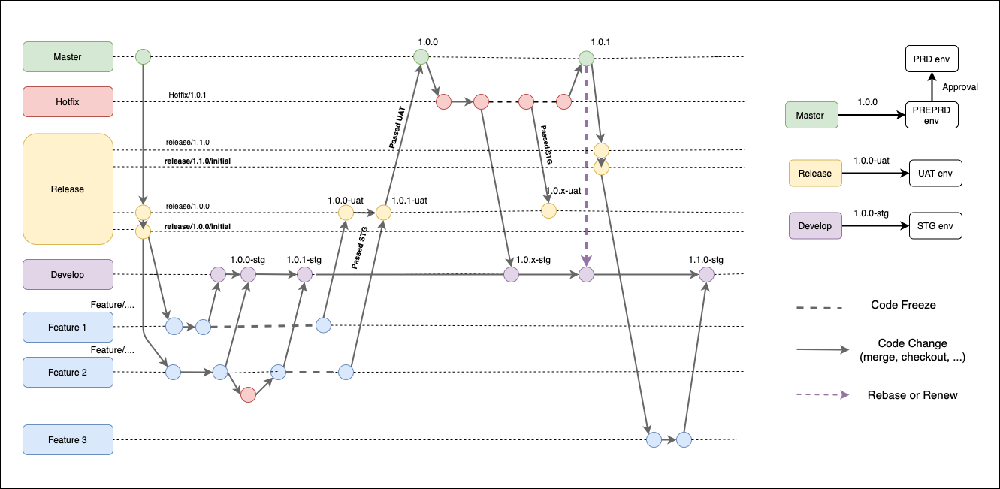

# Giới thiệu

Nội dung tài liệu này giới thiệu GitFlow dành cho Mobile App của công ty.

## Nội dung
- [Tóm tắt](#Tóm-tắt)
- [Quy ước](#Quy-ước)
- [Checkout](#Checkout)
- [Feature](#Feature)
- [Merge](#Merge)
- [Build Production](#Build-Production)
- [Hotfix](#Hotfix)

### Tóm tắt
- GitFlow:



- Xem thêm tại: https://novaid.atlassian.net/wiki/spaces/NTGE/pages/2523187/NovaID+git+workflow.

### Quy ước

- Nhánh main(master): là nhánh dùng để phát hành các bản build lên AppStore, GoogleStore.

- Nhánh develop: là nhánh tổng hợp các tính năng và được build trên môi trường Staging.

- Nhánh release-...: là nhánh sẽ chứa tất cả các tính năng được triển khai trong thời gian cụ thể và được build trên môi trường UAT.

- Nhánh release-.../initial: là một phiên bản gốc của release-... khi một feature cần checkout từ code gốc ban đầu.

- Nhánh release-.../feature/...: là nhánh chứa từng feature.

- Nhánh hotfix/...: là nhánh chứa code hotfix.

### Checkout

- Nhánh release-... được checkout từ main(master):

Ví dụ: release-sonarqube, release-ncomphase2

```ssh
git checkout master
git checkout -b release-ncomphase2
```

- Nhánh release-.../feature/... và release-.../initial được checkout từ release:

Ví dụ: release-sonarqube/feature/abc, release-ncomphase2/feature/abc

```ssh
git checkout release-ncomphase2
git checkout release-ncomphase2/initial
git checkout -b release-ncomphase2/feature/abc
```

### Merge

- Sau khi làm xong 1 feature thực hiện checkout 1 nhánh mới từ feature có name tương tự nhưng thêm vào đuổi `-staging`, nhánh này dùng để merge vào develop.

Ví dụ: release-ncomphase2/feature/abc-staging

- Sau khi staging được verify sẽ merge nhánh feature chính vào nhánh release. Tiến hành verify UAT.

### Build Production

- Sau khi verify release staging (Hoàn thành hết các features trên release này). Code tại release sẽ được merge vào main và tiến hành build production.

### Hotfix

- Nhánh hotfix/... checkout từ main(master):

Ví dụ: hotfix/NOVAID-123-homepage-search

- Sau khi hoàn thành task tạo 2 pull request tới main và develop. các release sẽ rebase từ main.

**Lưu ý: Khi tạo pull request không được check vào tick xoá branch sau khi merge.**


